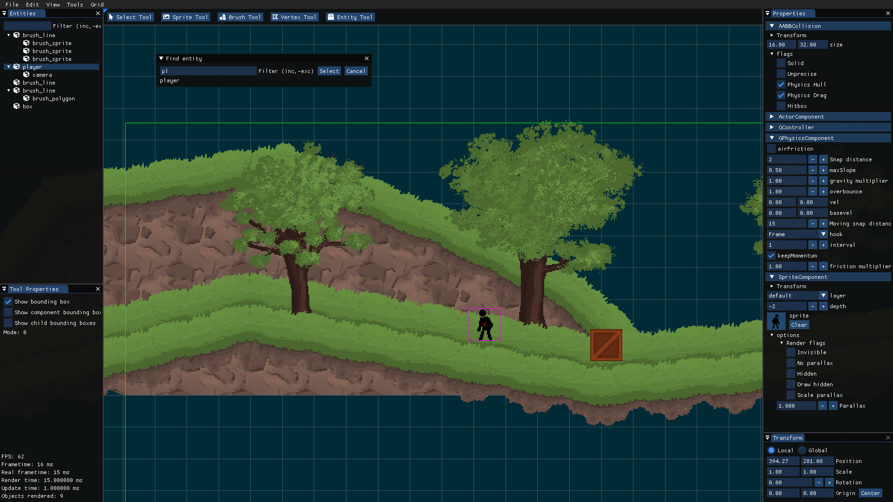
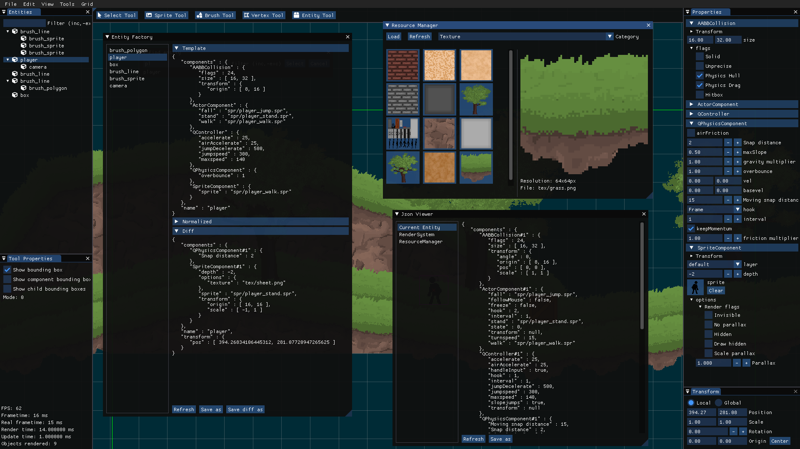
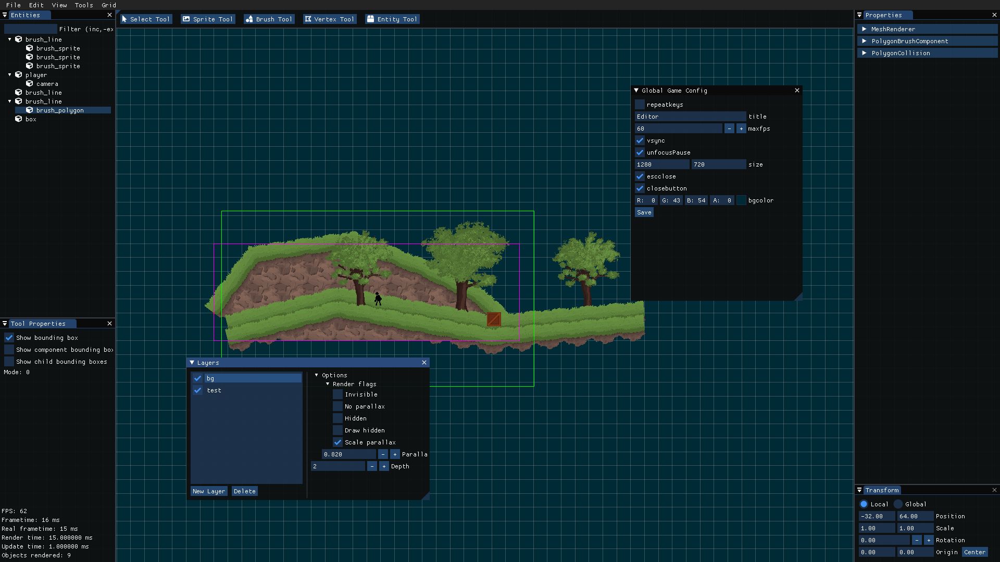

# GameLib

A (discontinued) WIP game engine written in C++ and based on SFML.


## Requirements
- [cmake](https://cmake.org)
- [git](https://git-scm.com/)
- [SFML 2.4 libraries](http://www.sfml-dev.org/)
- C++ environment with C++11 support (on Windows at least Visual Studio 2015)
- Boost filesystem

## Building
1. Open a terminal in a directory where you want to download the repository and type:

    ```shell
    $ git clone https://github.com/mphe/GameLib.git
    $ cd GameLib
    $ git submodule update --init --recursive
    ```

2. Open cmake-gui
3. Use the path to the repository you just cloned as source directory. Although it is recommended to use seperate directories, the build directory and the source directory can be the same.
4. Hit "Configure", select the generator you need and let it configure.
5. Configure the project as you wish and run "Configure" again when you make changes.

    Flag                        |   Function
    ----------------------------|-------------------------------------------------
    GAMELIB_BUILD_TESTS         |   Build unit tests
    GAMELIB_BUILD_EXAMPLES      |   Build examples
    GAMELIB_BUILD_EDITOR        |   Build the level editor
    GAMELIB_DEBUG_LOG_DEBUG     |   Print debug log entries in a debug-build
    GAMELIB_DEBUG_LOG_RELEASE   |   Print debug log entries in a release-build
    GAMELIB_DISABLE_LOGGING     |   Completely disable logging **(currently required when compiling with Visual Studio 2015, because of a compiler bug)**.
    GAMELIB_USE_CCACHE          |   Use ccache if available
    GAMELIB_SFML_ROOT           |   Points to the SFML directory. Only set this if it could not be found automatically. On Windows you usually have to set it manually.

    Don't touch anything else unless you know what you do.

6. After successful configuration hit "Generate" to generate the project files.
7. Compile it using the generated project files
8. The output files are stored in the build directory under "bin" and "lib".


## Screenshots




